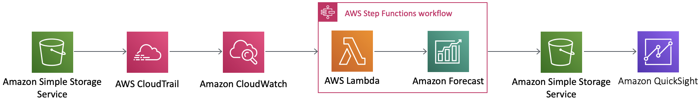
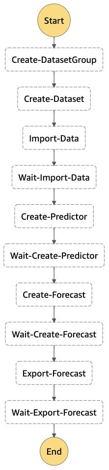
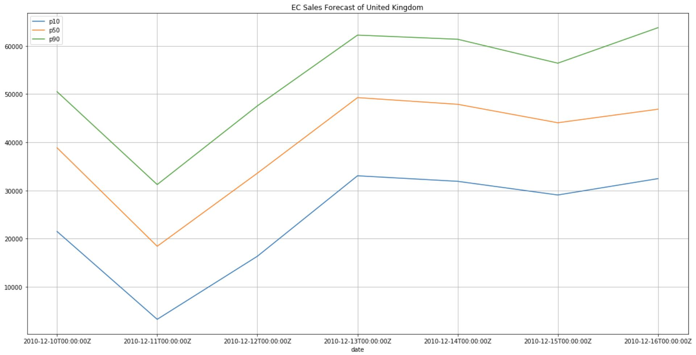

# Building automated pipeline for sales forecasting with simple code

In this workshop, we will build a forecasting pipeline with Amazon Forecast using Step Functions.
After building the pipeline, we store the retail data in S3, which automatically performs data import, training, and forecasting for Amazon Forecast and stores the results in S3. The results can be visualized in Amazon QuickSight, but for this workshop, we'll simply graph the results in a notebook.

## Architecture

The pipeline design is inspired by [AWS blog post here](https://aws.amazon.com/blogs/machine-learning/building-ai-powered-forecasting-automation-with-amazon-forecast-by-applying-mlops/).

## Lab Structure

Here are the steps.
First, git clone the repository and run 0_project_dependencies.ipynb. This will create a CloudFormation demo environment, running in a boto3-enabled environment, where CloudFormation allows you to run Lambda functions, CloudTrail, SageMaker notebook instances, interfaces The S3 bucket is created as follows.

1_build_statemachine.ipynb on the built SageMaker notebook instance. Run. This will build a pipeline with Step Functions, which is the theme of this workshop. Also, set up CloudWatchEvents Rule so that StepFunctions is executed when the file is stored in S3.

On the SageMaker notebook instance, create 2_preprocess_and_put_dataset.ipynb to download and format the retail data. In this case, we will simply estimate the daily sales amount in the United Kingdom. We store the formatted data in S3 and make sure that the StepFunctions statemachine is started. Wait until the pipeline is completed.

When the pipeline process is complete, confirm that the predictions have been output to S3. 3_visualization.ipynb to simply visualize your prediction results. I hope you've found it easy to build your pipeline. 

The final step is to clean up the mess.
Run 4_clean.ipynb on your SageMaker notebook instance to clean up all the resources used. This concludes the workshop.

## Conclusion

This workshop focuses on understanding and gives you experience building a pipeline with the simplest code. We hope that you will use this source code as a basis for customizing it to fit your own project requirements.
